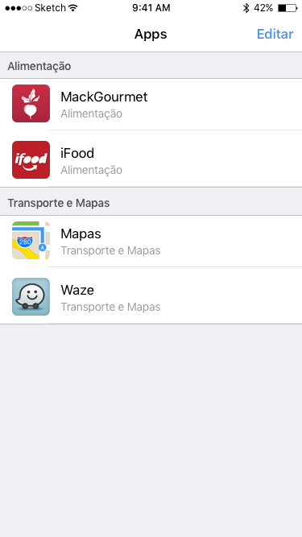

# Challenge TableView

## Desafio Lata

Crie uma aplicativo iOS utilizando UITableView. Este aplicativo deve permitir ao usuário cadastrar apps (*conforme o exemplo visto em aula*)

Cada célula deverá conter uma foto (ou icone) do app, o nome e sua categoria (por exemplo: entretenimento, educação, esportes, estilo de vida, finanças, etc)

## Desafio Bronze

Altere sua tabela para permitir edições (alterações de posição e conteúdo). Obviamente tais alterações devem ser refletidas na base de dados (*Data Source*).

## Desafio Prata

Agora permita que uma das células possa ser deletada. Obviamente tal deleção deve ser refletida na base de dados (*Data Source*).

## Desafio Ouro

A tabela deve também separar as células em categorias (as categorias dos apps propriamente ditas). Utilize as seções da UITableView.

